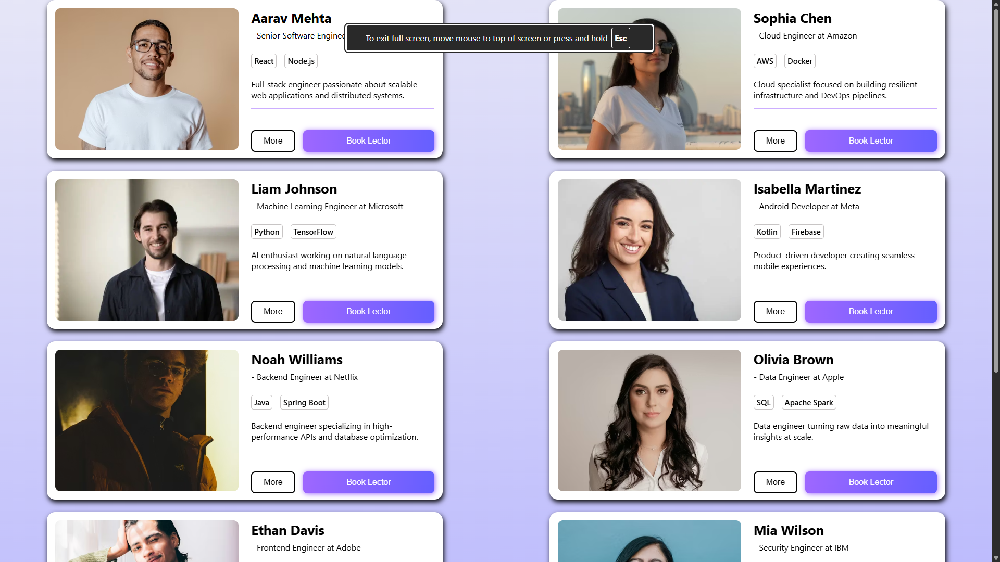

# React Props Practice – Profile Cards

This is a small React practice project created to understand how **props** work in React and how data can be passed between components.

The project displays a list of professional profile cards such as software engineers, data engineers, and developers. Each card is rendered using a reusable React component and receives its data through props.

## Features

- Reusable React components
- Passing data using props
- Card based UI layout
- Simple responsive design
- Dynamic rendering of multiple profiles

## Concepts Practiced

- React components
- Props
- Component reuse
- Basic project structure

## Project Structure

```bash
├── public/ (400 tokens)
    ├── preview.png
    └── vite.svg (300 tokens)
├── vite.config.js
├── src/ (3400 tokens)
    ├── main.jsx
    ├── App.css (200 tokens)
    ├── components/ (300 tokens)
    │   └── card.jsx (300 tokens)
    ├── index.css (700 tokens)
    ├── assets/ (900 tokens)
    │   └── react.svg (900 tokens)
    └── App.jsx (1200 tokens)
├── .gitignore
├── index.html
├── package.json (200 tokens)
├── eslint.config.js (200 tokens)
└── README.md (300 tokens)
```


## Example

Each profile card receives props like:

- name
- role
- company
- skills
- description
- profile image

These props are then displayed inside the reusable `ProfileCard` component.

## Screenshot



## Tech Used

- React
- JavaScript
- CSS

## Purpose

This project was created purely for learning and practicing **React props and component reuse**.
